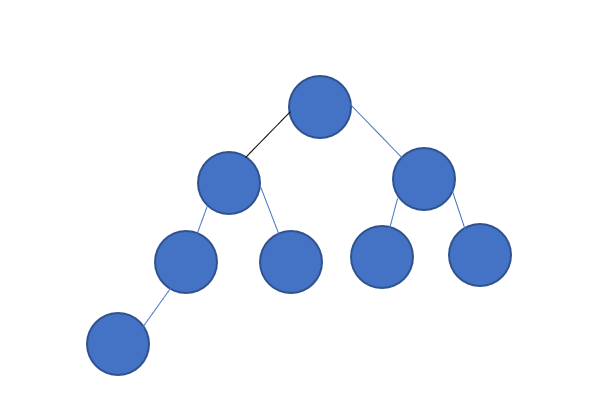
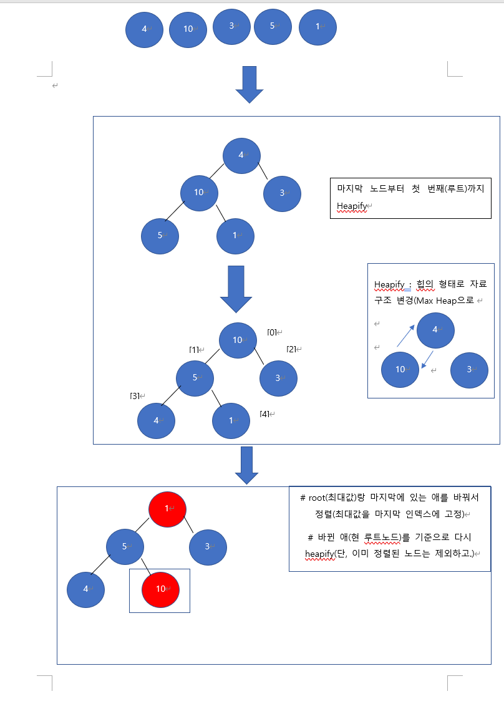

출처: 인프런 강의

지구에서 제일 쉽게 설명한 자료구조와 알고리즘- 개복치 개발자
수업 때 들은 내용을 바탕으로 간략하게 요약한 내용입니다. 틀린 내용이 있거나 고쳐야 할 점이 있다면 가르쳐주신다면 감사하겠습니다.
문제가 될 시 바로 게시글 내리도록 하겠습니다.
https://www.inflearn.com/course/%EC%9E%90%EB%A3%8C%EA%B5%AC%EC%A1%B0-%EC%95%8C%EA%B3%A0%EB%A6%AC%EC%A6%98-1/dashboard

- 동작방식
1. 사전 지식
   1. Heap : 최대값, 최소값을 찾아내기 위해 고안된 완전이진트리 형태의 자료구조
   2. 완전이진트리(complete binary tree) : 
      1. 마지막 레벨을 제외하고 모든레벨이 꽉 채워져 있고
      2. 마지막 레벨의 모든 노드는 가장 왼쪽으로 몰려있다.
      
2. 동작 방식

- 시간복잡도 : N logN
1. heap형태 정렬  ex) 8개의 데이터를 max heap으로 만들려면 3번의 작업이 필요,3개의 데이터는 1번
2. 그 과정을 각각의 노드 개수만큼 -> N x logN