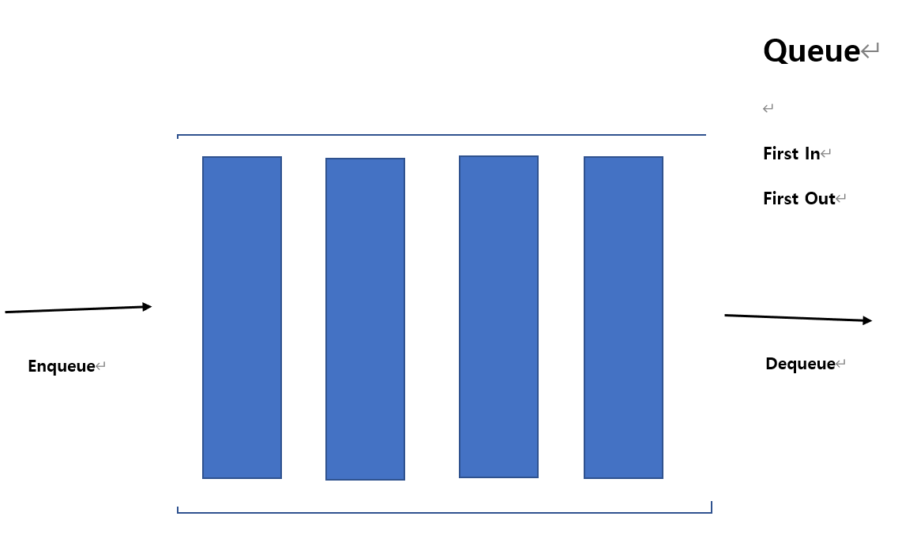
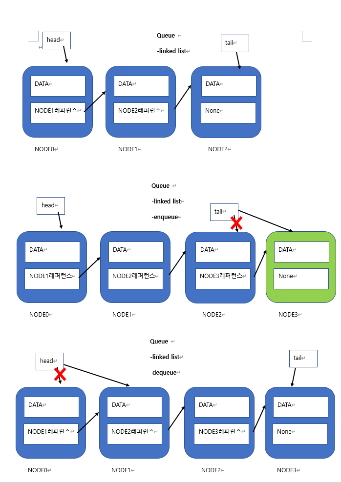

출처: 인프런 강의

지구에서 제일 쉽게 설명한 자료구조와 알고리즘- 개복치 개발자

수업 때 들은 내용을 바탕으로 간략하게 요약한 내용입니다. 틀린 내용이 있거나 고쳐야 할 점이 있다면 가르쳐주신다면 감사하겠습니다.

문제가 될 시 바로 게시글 내리도록 하겠습니다.

https://www.inflearn.com/course/%EC%9E%90%EB%A3%8C%EA%B5%AC%EC%A1%B0-%EC%95%8C%EA%B3%A0%EB%A6%AC%EC%A6%98-1/dashboard

